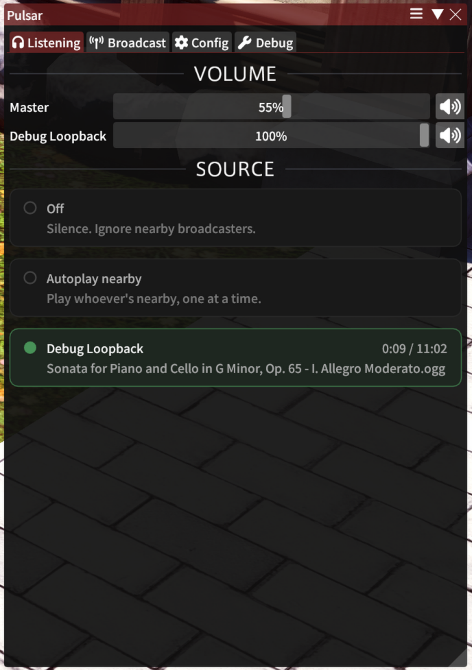
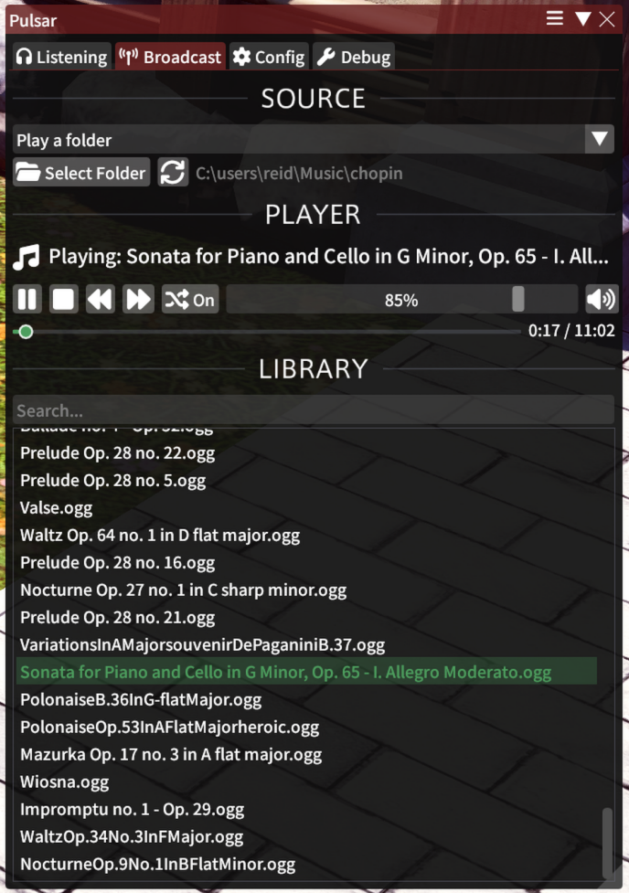
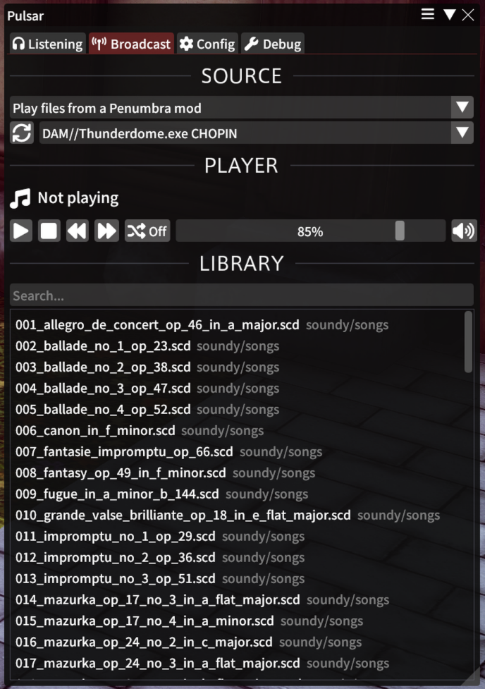
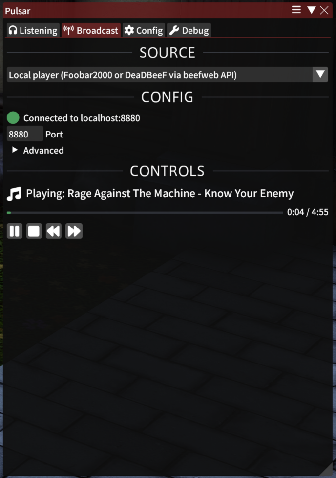

<p align="center">
  
</p>

# Pulsar

**NOTE: PULSAR IS AN UNRELEASED WORK IN PROGRESS.** Release ETA: late August / early Sept.

Pulsar is a music plugin for the Mare family of syncing services. To use Pulsar:

* Both the DJ **and** the listener must have Pulsar installed.
* Both must be using a sync service that supports Pulsar.
    * At the time of writing: none does.
    * At release: Lightless will.
    * We hope other syncs will integrate it, too. (That's why it's a separate plugin and not integrated directly in
      Lightless.)

## Installation

Repo

```
https://raw.githubusercontent.com/Drovolon/Pulsar/repo/repo.json
```

## How it Works

Pulsar works very differently from the normal DJ setup folks use with Penumbra mods like Thunderdome.exe. Pulsar has its
own playback output, totally independent of the game. While someone is broadcasting, they can move around freely: redraw
their character, switch outfits, use whatever emotes they like. It's not tied to the game at all. Pulsar also
automatically plays the next song when the current one finishes. See the broadcasting section for more details.

Pulsar is integrated directly with the sync plugin. Files sync just like Penumbra mods. The broadcaster's position in
the song are part of the character data that is synced. This is why it requires a sync plugin with Pulsar integration.

## Listening

Use `/pulsar` to open the UI.



It will show anyone around you broadcasting.

If someone is playing music you don't like, you can mute them or pause sound sync with them.

In-game volume has no effect on Pulsar. Its playback is totally independent of the game. Only the controls in /pulsar
affect it.

### Song Position Quirk

Pulsar keeps everyone within 15 seconds of the DJ's actual position. So, when you first load a venue, for example,
you'll start hearing a song *in the middle* - along with everyone else.

And yes, if the DJ seeks in the song, that seek is synced and everyone will hear it.

## Broadcasting

Use `/pulsar` to open the UI.

The **On Air** switch controls whether your playback is sent to nearby pairs. It starts off after every plugin reload,
so you can build a queue and monitor it locally before broadcasting.

* Play from folder: finds all sound files (recursively) in a folder.
* Play from mod: same as play from folder, but uses Penumbra IPC to let you pick a mod instead of hunting for the folder
  on disk. For DAM-style mods, Pulsar **attempts** to detect option groups that act as genre playlists. "All Files" is
  always available if mod groups aren't detected properly.
* Pulsar player: starting any library track plays its entire folder or mod group from that point. A manual queue can
  override what plays next, with duplicate, reorder, removal, and clear support; the compact **Up Next** view combines
  those queued overrides with the upcoming source tracks. **Shuffle Upcoming** changes only the source order and
  preserves the hand-built queue. Browsing another folder, mod, or group does not interrupt the active source.
* Beefweb: Connects to foobar2000 or DeaDBeeF using the beefweb API. Requires installation of the beefweb component in
  foobar2000 or DeaDBeeF to function. Switching to Beefweb while On Air keeps the current Pulsar-queue broadcast live
  until Beefweb has a syncable track ready. **NOTE**: DSP effects like equalizers, etc., are NOT synced. Just the file
  you're playing and your position in the song.





### Transcoding and ReplayGain

Any file with >=128 Kbps per channel is transcoded to Opus @ 80 Kbps per channel before being synced. For a consistent
listening experience, track-level ReplayGain is forcibly applied as part of the output gain stage (-18 LUFS target).

## Other Docs

* [DESIGN.md](./DESIGN.md) - technical information
* [CONTRIBUTING.md](./CONTRIBUTING.md) - how to contribute (for developers)
* [API.md](./API.md) - IPC API docs and general sync integration guide
* [AI-DECLARATION.md](./AI-DECLARATION.md) - declaration of "AI" (LLM) usage

## About the Author

Pulsar was created by Drovolon, one of the developers of Lightless. (Discord: @drovolon)
